# Cloud-Services-Deep-Dive
Multi-Cloud Infrastructure Automation and Optimization

## Scope
This project covers multiple core services on various cloud platforms. This project is WIP and as I dive into additional services this will be expanded.

## Services
`AWS`

**ECS** Container orchestration and administration via AWS

**IAM** Users, groups and policies administration and management - Identity and Access Management

## Environment
- AWS GUI Console
- Cloudshell
  
## Tasks - IAM

### Determine the number of created users using the GUI.
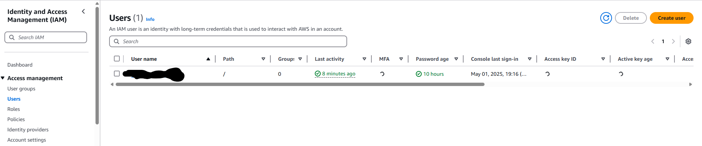

### Validate logged-in user deatils using Cloudshell.
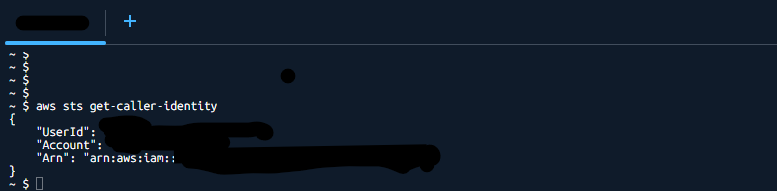

### Validate user does not belong to any groups using the GUI.
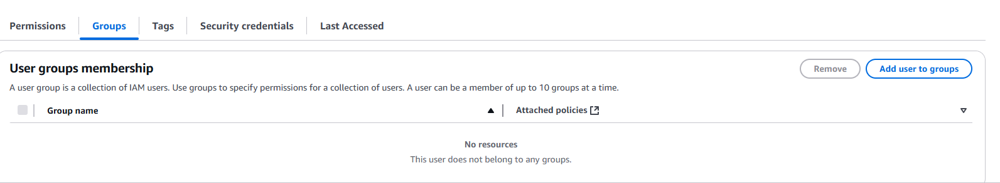

### Create user and attach ReadOnly policy.
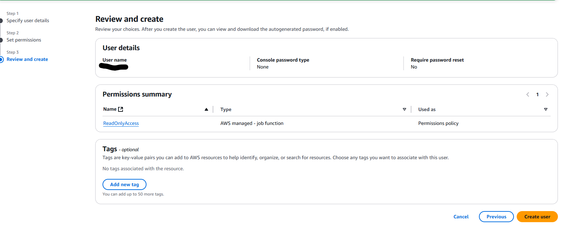

### Confirm both users are now showing as created and available via the GUI.
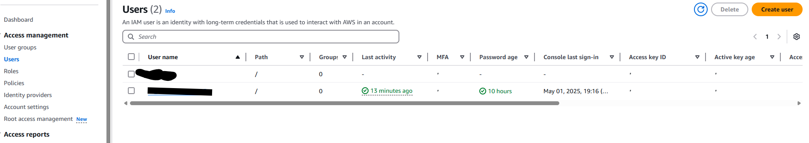

### Validate what permissions the ReadOnlyAccess policy provides by reviewing the JSON file.
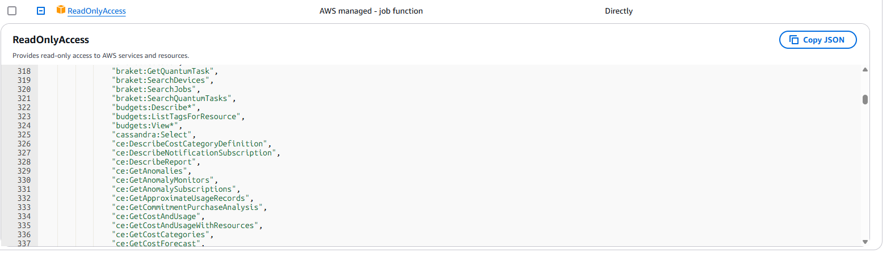

### Ceate second user and attach the ViewOnlyAccess policy.
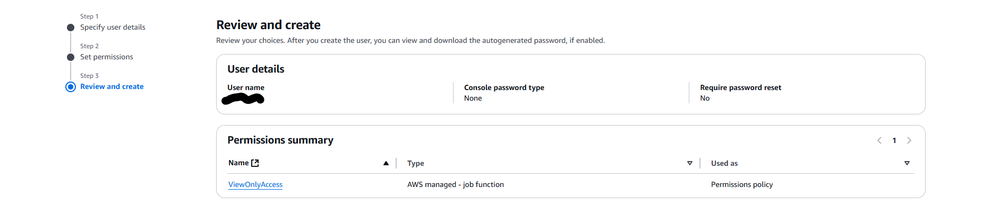

### Validate what permissions the ViewOnlyAccess policy provides by reviewing the JSON file.
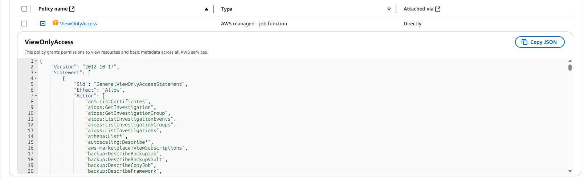

### Detach ReadOnlyAccess policy from user 1.
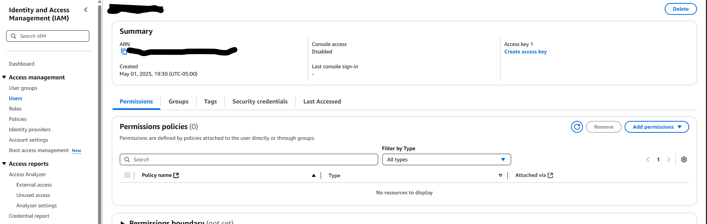

### Create group 1 and attach ReadOnlyAccess policy to it.
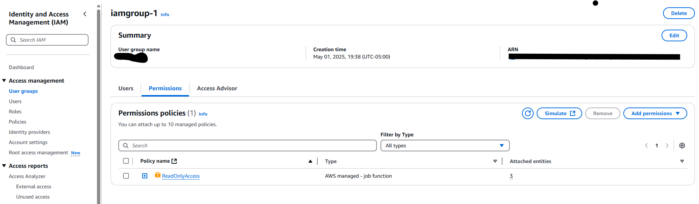

### Add user 1 to group 1.
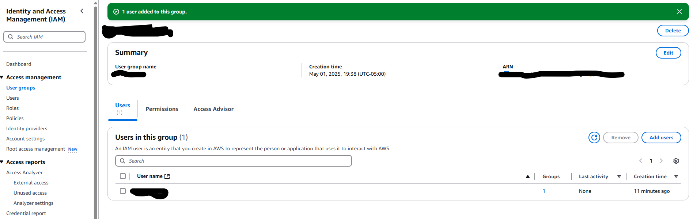

### Create group 1 and attach ViewOnlyAccess policy to it.
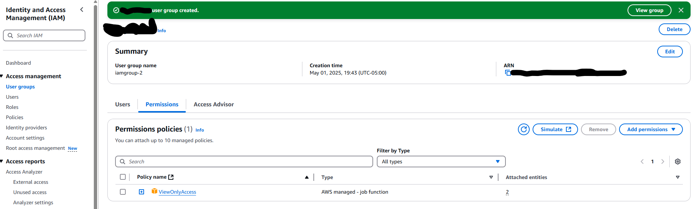

### Detach ViewOnlyAccess policy from user 1.
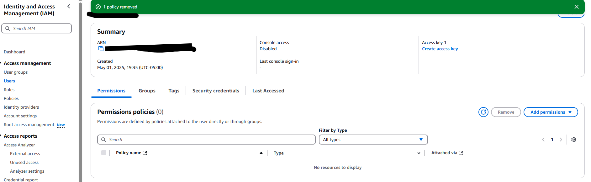

### Add user 2 to group 2.
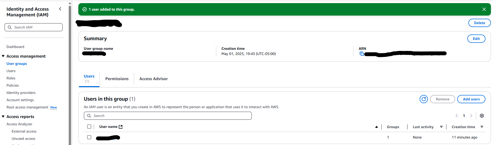
